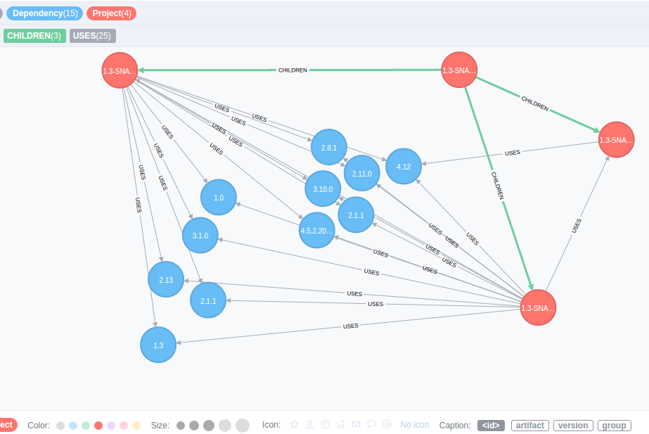
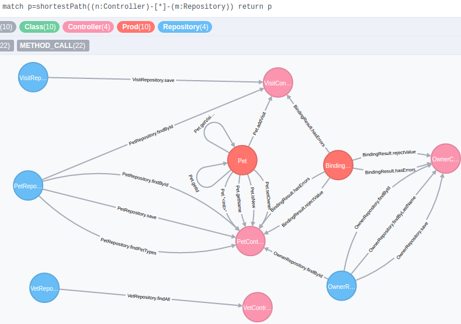

## Profiling Projects with Graphs

### Maven-Dependency-Graph

To manage the dependencies in a project it is necessary to look of the whole dependency-graph.
With maven you can export the dependency-tree but not the graph, also you cannot detect pattern of it.
To solve this problems the `mvngraph.sh` exports the maven depencency graph into your neo4j-database, where you can use pattern-matching with `cypher`.
The extracted relationships of the dependencies are: `CHILDREN` - for submodules and `USES` - for dependencies, the node-labels are: `project` and `dependency`.



### Method-Call-Graph

If you want to see all method-calls in a project (for example to extract micro-services),
a method-call-graph is very useful.
You can extract further informations from class-files with javap, but not the graph.
To get the graph and export it to neo4j, you can use `methodgraph.sh`.
The extracted relationship of method-graph is: `METHOD_CALL` with the name and parameter of the call.
General all nodes have the label: `Class`. 
Specifically you can also use the labels: `Test`, `Prod`, `Repository` or `Controller` to identify your software-architecture.



### Before you start

- configure your neo4j-connection in the neo4j_connection file
- you need to call the cypher-shell from your neo4j-db

```
<path-to-neo4j>/bin/cypher-shell -u username -p password
```
